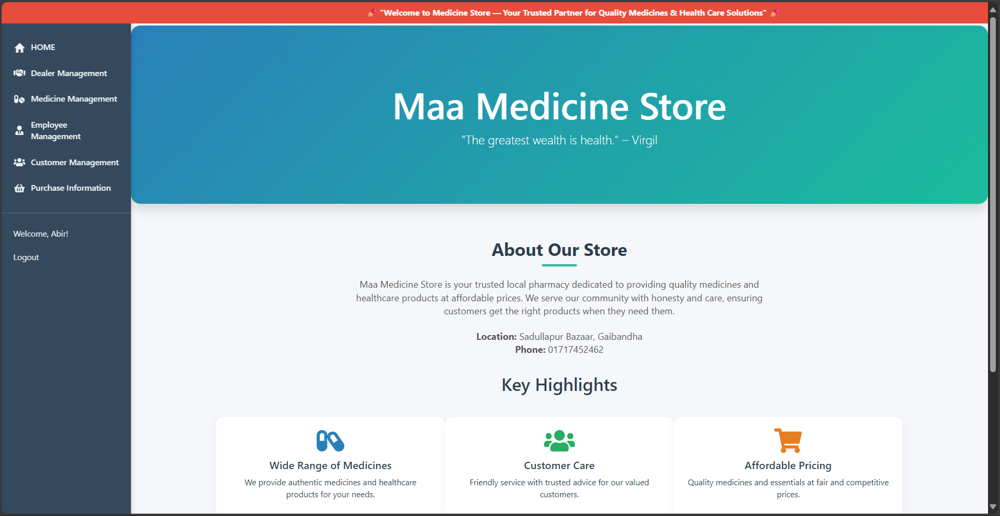

# Maa Medicine Store Management System

A Django-based web application for managing a medicine store. This project helps with managing medicines, dealers, sales, and inventory efficiently.

## Features

- Add, update, and delete medicines
- Manage dealer information
- Track sales and stock levels
- User-friendly interface with Bootstrap 3
- Secure authentication (if implemented)

## Technologies Used

- Python 3.x
- Django Web Framework
- Bootstrap 3 for frontend styling
- SQLite (default) or any other database supported by Django

## Demo

### Medicine List Page




## Installation

1. **Clone the repository:**

   ```bash
   git clone https://github.com/InfinityAbir/Maa-Medicine-Store.git
   cd Maa-Medicine-Store
2. **Create and activate a virtual environmen:**
   python -m venv env
   source env/bin/activate  # On Windows: env\Scripts\activate
4. **Install required packages:**
   pip install -r requirements.txt
5. **Apply migrations:**
   python manage.py migrate
6. **Run the development server:**
   python manage.py runserver
7. **Open your browser and go to** http://127.0.0.1:8000/
